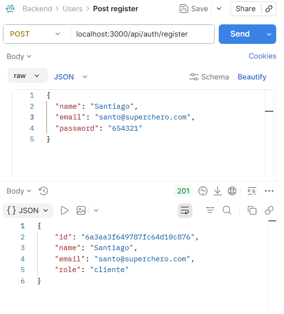
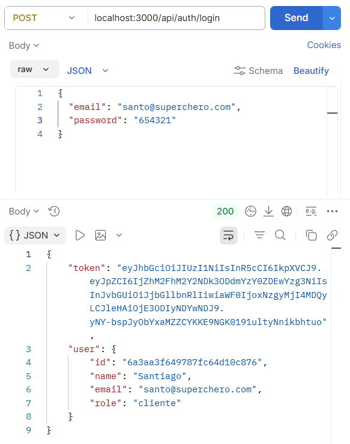
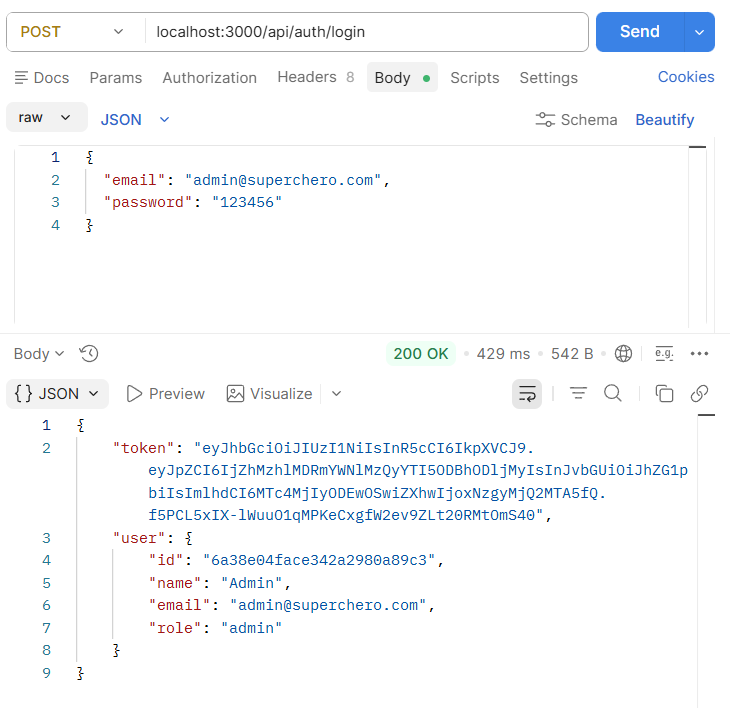
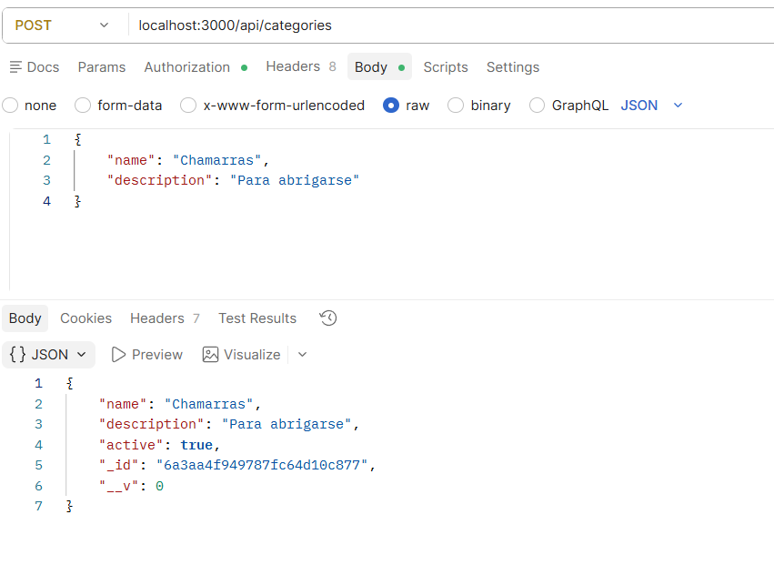
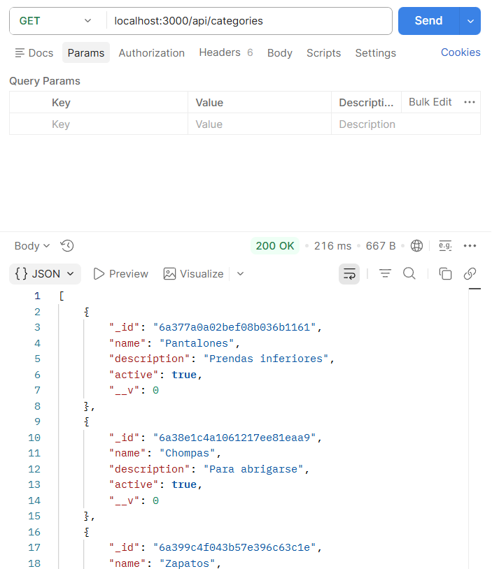
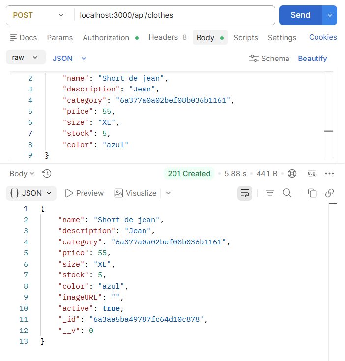
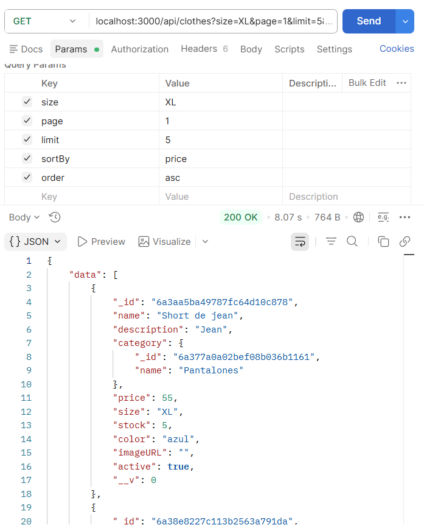
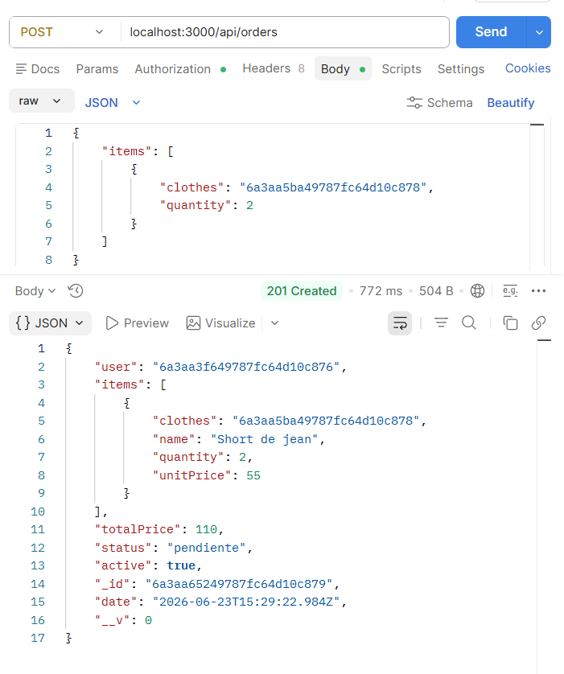
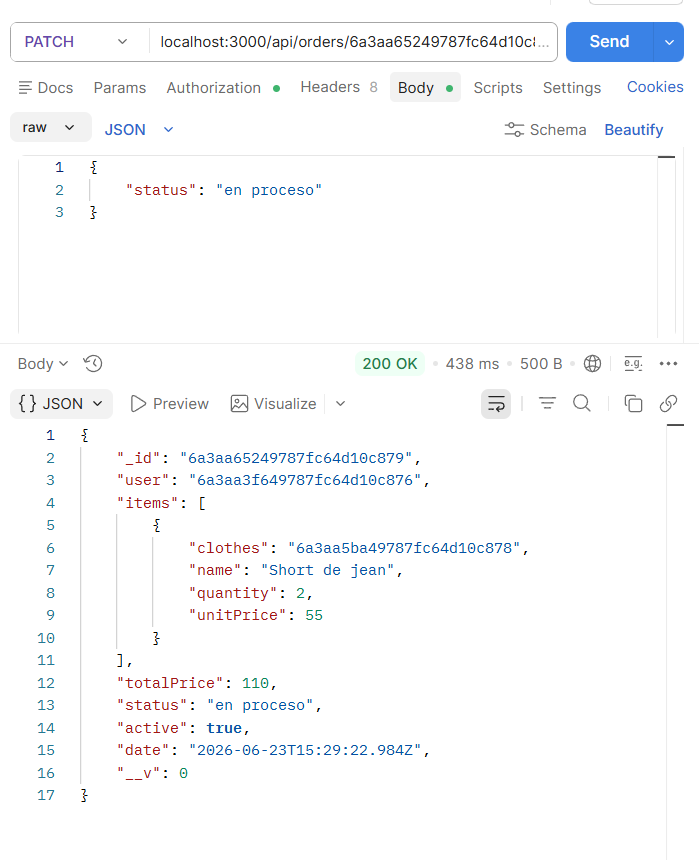
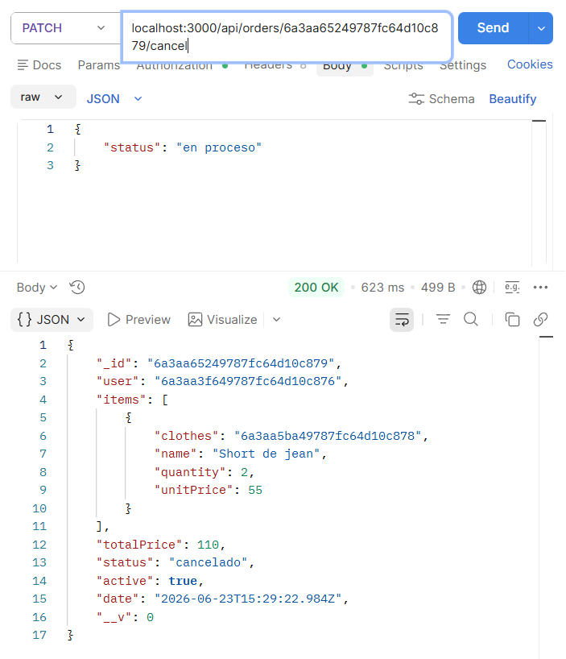

# Proyecto Final -Certificación Backend

## Grupo 13

**Integrantes:**
- Paola Rebeca Navarro Saravia 68919
- Mariana Del Arroyo Rengel 73295

---

## 1. Descripción del proyecto
El proyecto consiste en una aplicación web para la gestión de un catálogo de prendas de ropa, permitiendo a los clientes consultar el catálogo, realizar pedidos y gestionar su historial de compras. Los administradores podrán registrar, editar y eliminar prendas, así como administrar categorías y gestionar los pedidos realizados por los clientes.

El sistema maneja cuatro entidades principales: **categorías**, **prendas**, **usuarios** y **pedidos**, con autenticación por token y autorización según el rol del usuario.

## 2. Tecnologías
 
- **Node.js** — entorno de ejecución
- **Express.js 5** — framework del servidor
- **MongoDB Atlas** — base de datos en la nube
- **Mongoose** — modelado de datos (ODM)
- **JSON Web Token (JWT)** — autenticación basada en tokens
- **bcrypt** — encriptación de contraseñas
- **dotenv** — manejo de variables de entorno
- **Postman** — pruebas de los endpoints
- **GitHub** — control de versiones
- **Render** — despliegue

## 3. Arquitectura

El proyecto sigue una **arquitectura por capas**, separando responsabilidades:
 
```
SuperChero/
└── src/
    ├── app.js              # Punto de entrada: configura Express y monta las rutas
    ├── data/               # Conexión a MongoDB y modelos
    ├── routes/             # Definición de endpoints por recurso
    ├── controllers/        # Manejo de solicitudes y respuestas, y errores
    ├── services/           # Lógica de negocio y acceso a la base de datos
    ├── middlewares/        # Autenticación, autorización y manejo de errores
    └── utils/              # Validadores y utilidades 
```

## 4. Instalación y ejecución en entorno local

```bash
# 1. Clonar el repositorio
git clone https://github.com/RebecaNavarro/ProyectoFinal-CertificacionBackend.git
 
# 2. Entrar a la carpeta del proyecto
cd ProyectoFinal-CertificacionBackend/SuperChero
 
# 3. Instalar dependencias
npm install
 
# 4. Crear el archivo .env (ver sección siguiente)
 
# 5. Levantar el servidor en modo desarrollo
npm run dev

# Una vez todo esté bien, se mostrará en consola un mensaje de que el servidor está corriendo en el puerto especificado.
# La API quedará disponible en `http://localhost:3000`.
```

## 5. Configuración del archivo .env

Crea un archivo `.env` dentro de `SuperChero/` con las siguientes variables:
 
```
PORT=3000
MONGODB_URI=tu_uri_de_mongodb
JWT_SECRET=tu_clave_secreta
```

## 6. Despliegue

**Link del deploy:**
https://proyectofinal-certificacionbackend.onrender.com/

## 7. Endpoints

### Autenticación — `/api/auth`
 
| Método | Endpoint | Descripción | Acceso |
|---|---|---|---|
| POST | `/api/auth/register` | Registrar usuario (siempre como cliente) | Público |
| POST | `/api/auth/login` | Iniciar sesión y obtener el token JWT | Público |
 
### Usuarios — `/api/users`
 
| Método | Endpoint | Descripción | Acceso |
|---|---|---|---|
| GET | `/api/users` | Listar usuarios | Admin |
| GET | `/api/users/:id` | Obtener un usuario | Admin |
| POST | `/api/users` | Crear un usuario (puede ser admin) | Admin |
| PATCH | `/api/users/:id` | Actualizar un usuario | Admin |
| DELETE | `/api/users/:id` | Baja lógica de un usuario | Admin |
 
### Categorías — `/api/categories`
 
| Método | Endpoint | Descripción | Acceso |
|---|---|---|---|
| GET | `/api/categories` | Listar categorías (solo activas por defecto) | Público |
| GET | `/api/categories/:id` | Obtener una categoría | Público |
| POST | `/api/categories` | Crear una categoría | Admin |
| PATCH | `/api/categories/:id` | Actualizar una categoría | Admin |
| DELETE | `/api/categories/:id` | Baja lógica de una categoría | Admin |
 
### Prendas — `/api/clothes`
 
| Método | Endpoint | Descripción | Acceso |
|---|---|---|---|
| GET | `/api/clothes` | Listar prendas (con filtros, paginación y orden) | Público |
| GET | `/api/clothes/:id` | Obtener una prenda | Público |
| POST | `/api/clothes` | Crear una prenda | Admin |
| PATCH | `/api/clothes/:id` | Actualizar una prenda | Admin |
| DELETE | `/api/clothes/:id` | Baja lógica de una prenda | Admin |
 
**Parámetros de consulta disponibles en `GET /api/clothes`:**
 
| Parámetro | Ejemplo | Descripción |
|---|---|---|
| `category` | `?category=<id>` | Filtra por categoría |
| `size` | `?size=M` | Filtra por talla |
| `color` | `?color=negro` | Filtra por color |
| `active` | `?active=false` | Incluye prendas inactivas |
| `page` | `?page=1` | Número de página |
| `limit` | `?limit=10` | Resultados por página |
| `sortBy` | `?sortBy=price` | Campo por el que ordenar |
| `order` | `?order=asc` | Sentido del orden (`asc` / `desc`) |

Ejemplo: `GET /api/clothes?category=<id>&size=M&page=1&limit=5&sortBy=price&order=asc`
 
### Pedidos — `/api/orders`
 
> Todas las rutas de pedidos requieren sesión iniciada (token JWT).
 
| Método | Endpoint | Descripción | Acceso |
|---|---|---|---|
| POST | `/api/orders` | Crear un pedido (valida y descuenta stock) | Cliente |
| GET | `/api/orders` | Listar todos los pedidos | Admin |
| GET | `/api/orders/mine` | Listar mis pedidos | Cliente |
| GET | `/api/orders/user/:userId` | Listar los pedidos de un cliente | Admin |
| GET | `/api/orders/:id` | Obtener un pedido | Dueño o Admin |
| PATCH | `/api/orders/:id/status` | Cambiar el estado de un pedido | Admin |
| PATCH | `/api/orders/:id/cancel` | Cancelar un pedido (devuelve el stock) | Dueño o Admin |
 
---
 
## 8. Reglas de negocio principales
 
- El **registro público** solo crea usuarios con rol *cliente*; los administradores se crean únicamente desde `/api/users`.
- Solo los **administradores** pueden crear, actualizar o dar de baja categorías, prendas y usuarios.
- Solo los **clientes** pueden crear pedidos, y deben tener sesión iniciada.
- El **total del pedido se calcula en el backend** a partir de los precios reales de la base de datos.
- Al crear un pedido se **verifica y descuenta el stock**; al cancelarlo, el stock se **devuelve**.
- Un pedido solo avanza entre los estados válidos: `pendiente` → `en proceso` → `enviado` → `entregado`, o `cancelado`.
- Un cliente solo puede ver o cancelar **sus propios** pedidos.
- Todos los borrados son **lógicos** (campo `active: false`); la información no se elimina de la base.
- El **email** de cada usuario es único y las contraseñas se guardan **encriptadas con bcrypt**.
- Las categorías y prendas **inactivas** no se muestran en el catálogo por defecto.
---
  
## 9. Pruebas con Postman
 
A continuación se documenta el flujo de pruebas de la API con sus respectivas capturas.
 
### 1. Autenticación
 
**Registro de usuario**
 

 
**Inicio de sesión (obtención del token)**
 


 
### 2. Categorías
 
**Crear categoría (admin)**
 

 
**Listar categorías**
 

 
### 3. Prendas
 
**Crear prenda (admin)**
 

 
**Listar prendas con filtros y paginación**
 

 
### 4. Pedidos
 
**Crear pedido (cliente) — total calculado**
 

 
**Cambiar estado del pedido (admin)**
 

 
**Cancelar pedido**
 

 
 

